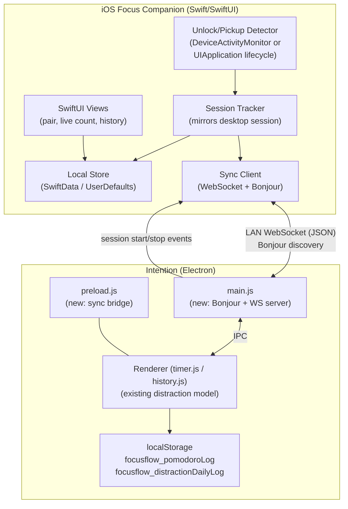
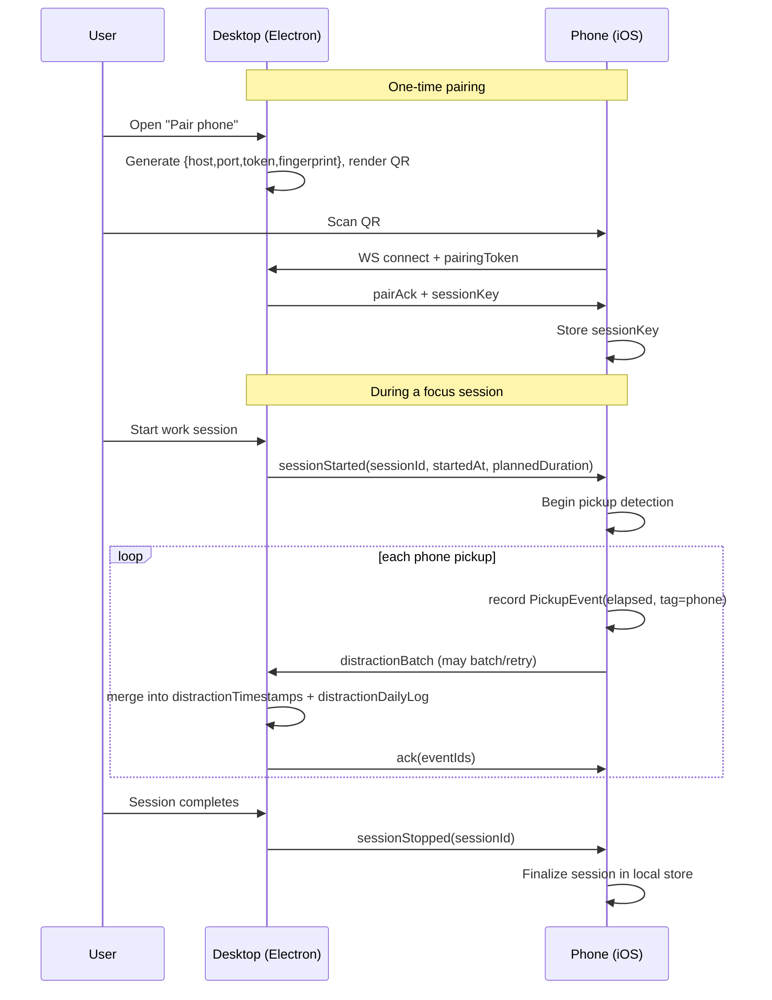

# Design Document: iOS Focus Companion

## Overview

The **iOS Focus Companion** is a native Swift/SwiftUI app that extends the existing Intention Electron desktop app to the phone. Its job is narrow and specific: while a Pomodoro focus session is running on the desktop, the phone measures how often you pick it up (unlocks / app switches) and records each pickup as a **distraction event** aligned to the desktop's existing data model. Those events are then synced back to the desktop and merged into Intention's distraction timeline and history heatmap.

The design honors Intention's core promise: **local-first, no accounts, no cloud, no analytics.** The recommended sync path is a direct device-to-device connection over the local network (LAN) with QR-code pairing. No distraction data leaves your two devices. A cloud relay is described as an explicit opt-in fallback for people who want cross-network sync, but it is not the default.

This document contains both a **High-Level Design** (system architecture, components, data models, cross-device data flow) and a **Low-Level Design** (algorithms and Swift/pseudocode signatures for unlock detection, session tracking, pairing, and sync, plus the Electron-side changes required to accept and merge phone data).

---

# Part 1 — High-Level Design

## Architecture



**Flow in one sentence:** the desktop advertises a small local WebSocket server over Bonjour; the phone discovers and pairs with it via QR code; the desktop pushes session start/stop events to the phone; the phone counts pickups during the session and pushes distraction events back; the desktop merges them into the existing distraction log and history.

## Components and Interfaces

### Component Responsibilities

#### iOS side

| Component | Responsibility |
|-----------|----------------|
| **Unlock/Pickup Detector** | Detects when the user picks up / uses the phone during an active focus session. Two implementation strategies (see decision below). |
| **Session Tracker** | Holds the current session state mirrored from the desktop (start time, planned duration, mode). Converts each pickup into a distraction event with `elapsed` seconds. |
| **Local Store** | Persists sessions and distraction events on-device so data survives app restarts and offline periods; drives the local history view. |
| **Sync Client** | Discovers the desktop via Bonjour, maintains the paired WebSocket connection, sends/receives JSON messages, and queues events when offline. |
| **SwiftUI Views** | Pairing screen (scan QR), live session view (running pickup count), local history, settings. |

#### Electron side (new work)

| Component | Responsibility |
|-----------|----------------|
| **Bonjour + WS server (main.js)** | Advertises `_focusflow._tcp` service on LAN and runs a WebSocket server that accepts one paired phone. Emits `sessionStarted` / `sessionStopped` to the phone and receives `distractionBatch` from it. |
| **Sync bridge (preload.js)** | Exposes safe IPC methods so the renderer can react to incoming phone distractions and generate the pairing QR/token. |
| **Renderer merge logic (timer.js/history.js)** | Merges phone-originated distraction events into `distractionTimestamps` (live timeline) and `distractionDailyLog` (history), tagging them as `phone`. |

### Core Interfaces / Protocols

The core interfaces and protocols that these components implement (`PickupDetector`, `SyncClient`, `PairingPayload`) are defined in detail in the **Core Interfaces/Types** subsection of Part 2 — Low-Level Design. They are summarized here to complete the component picture:

- **`PickupDetector`** — protocol implemented by the Unlock/Pickup Detector component; emits a `PickupEvent` for each detected phone pickup and exposes `start(session:)` / `stop()`.
- **`SyncClient`** — protocol implemented by the Sync Client component; provides `discover()`, `pair(with:)`, `connect()`, `send(_:)` and an `onMessage` callback.
- **`PairingPayload`** — the QR-encoded handshake struct (`host`, `port`, `deviceId`, `pairingToken`, `fingerprint`) exchanged during pairing.

## Unlock/Distraction Detection Strategy (Decision)

This is the central iOS design decision. iOS deliberately does **not** expose a raw "screen was unlocked" event to third-party apps for privacy reasons, so we must choose an App Store-legal approximation.

### Option A — Screen Time / Family Controls + DeviceActivity

- Uses the `FamilyControls`, `DeviceActivity`, and `ManagedSettings` frameworks. A `DeviceActivityMonitor` extension receives callbacks at interval and threshold boundaries; combined with usage thresholds it can approximate "how much the phone was used" during a window.
- **Pros:** works even when the companion app is backgrounded or closed; measures whole-device usage, which is exactly the distraction we care about; privacy-safe (Apple mediates, data stays on device).
- **Cons:** requires the **Family Controls entitlement**, which must be requested from Apple and is scrutinized in App Store review; the API reports *usage thresholds and intervals*, not discrete "unlock at time T" events, so exact per-pickup timestamps are approximate; more complex (app + monitor extension); the framework is oriented toward parental-control/self-limiting use cases.

### Option B — Foreground-session lifecycle counting (no special entitlement)

- The companion app runs in the foreground during a focus session (the user places the phone down with the app open, or the app is the last thing on screen). We observe `UIApplication` / `ScenePhase` transitions: each time the app moves from `active` to `inactive`/`background` and back, that round trip is counted as a **pickup** (the user turned the phone on / switched away and came back).
- **Pros:** no special entitlement, trivial App Store review; gives precise timestamps for each app-switch; simple to build; naturally privacy-safe (we only observe our own app's lifecycle).
- **Cons:** only counts pickups while the companion app is the foreground app before lock; if the user opens a *different* app directly from the lock screen without returning to the companion, that specific pickup can be under-counted; relies on a small behavioral convention (keep the companion app open during a session).

### Recommendation

**Ship Option B (lifecycle counting) as the v1 default, and design the detector behind a protocol so Option A can be added later as an optional "deep tracking" mode for users willing to grant Family Controls.**

Rationale: Option B is entitlement-free, passes review cleanly, gives exact timestamps that map perfectly onto the desktop's `elapsed`-based distraction timeline, and matches how people already use a Pomodoro phone timer (phone sits face-up running the app). Option A is strictly more powerful but adds an Apple entitlement request, review risk, and only approximate per-event timing — better as a follow-up. The detector abstraction (`PickupDetector` protocol, see Low-Level Design) means both strategies produce the same `PickupEvent` stream, so the rest of the app is unaffected by the choice.

## Connectivity / Sync Strategy (Decision)

Intention's identity is local-first with no cloud. The sync design must preserve that.

### Option 1 — Local LAN sync (Bonjour discovery + local WebSocket)

- The Electron main process runs a small WebSocket server bound to the LAN and advertises it via Bonjour/mDNS (`_focusflow._tcp`). The phone browses for the service, connects, and exchanges JSON. Pairing is confirmed with a QR code shown on the desktop.
- **Pros:** fully local — no data leaves the home/office network; no accounts; matches the privacy promise exactly; low latency for live session events.
- **Cons:** both devices must be on the same LAN; some networks block mDNS/peer traffic; requires adding a server + a networking dependency to Electron.

### Option 2 — Cloud relay (e.g. Supabase)

- Devices exchange data through a hosted relay (the sibling `quby-site` project already uses Supabase).
- **Pros:** works across any network, no LAN requirement; survives NAT/firewalls.
- **Cons:** breaks the "no cloud, no accounts, no data leaves your machine" promise unless made strictly opt-in and end-to-end encrypted; adds a dependency and a trust surface.

### Option 3 — QR-code pairing

- Not a transport by itself — it's the **pairing/handshake** mechanism. The desktop encodes its connection details + a one-time secret into a QR code; the phone scans it to learn where to connect and to authenticate.

### Recommendation

**Use Option 1 (LAN Bonjour + WebSocket) as the transport, with Option 3 (QR code) for pairing.** Keep Option 2 (Supabase relay) as an explicit, off-by-default opt-in for users who accept cross-network cloud sync. This preserves the local-first promise by default while offering a clear upgrade for people who ask for it.

**Pairing handshake (QR contents):** the desktop generates a JSON payload `{host, port, deviceId, pairingToken, fingerprint}`, renders it as a QR code, and the phone scans it. The `pairingToken` is a one-time secret used to authenticate the first WebSocket handshake; after success both sides store a long-lived `sessionKey` so re-pairing isn't needed. `fingerprint` lets the phone verify it's connected to the right desktop.

## Data Models

The iOS models are deliberately shaped to round-trip cleanly into the desktop's existing storage. The desktop stores (from `js/app.js`, `js/history.js`, `js/timer.js`):

- `focusflow_pomodoroLog` — `{ "YYYY-MM-DD": count }`
- `focusflow_distractionDailyLog` — `{ "YYYY-MM-DD": [ { time, cause, tag, duration } ] }`
- in-memory `timerState.distractionTimestamps` — `[ { elapsed, tag } ]` (tags: `phone` | `people` | `thought` | `other`)

### iOS: FocusSession

```swift
struct FocusSession: Codable, Identifiable {
    let id: UUID
    let dateKey: String          // "YYYY-MM-DD", matches desktop getDateKey()
    let mode: SessionMode        // .work, .shortBreak, .longBreak
    let startedAt: Date          // wall-clock start (from desktop sessionStarted)
    let plannedDuration: Int     // seconds (e.g. 25*60), from desktop
    var endedAt: Date?           // set when the session completes/stops
    var pickups: [PickupEvent]   // distraction events for this session
}

enum SessionMode: String, Codable { case work, shortBreak, longBreak }
```

### iOS: PickupEvent

```swift
struct PickupEvent: Codable, Identifiable {
    let id: UUID
    let elapsed: Int             // seconds since session start -> maps to timeline
    let occurredAt: Date         // wall-clock (for local history / dedup)
    var tag: DistractionTag      // defaults to .phone (this IS a phone pickup)
    var synced: Bool             // false until acked by desktop
}

enum DistractionTag: String, Codable {
    case phone, people, thought, other
}
```

### Wire format (phone -> desktop)

```jsonc
{
  "type": "distractionBatch",
  "sessionId": "9f3c...-uuid",
  "dateKey": "2025-06-14",
  "events": [
    { "id": "a1b2-...", "elapsed": 143, "occurredAt": "2025-06-14T10:32:23Z", "tag": "phone" },
    { "id": "c3d4-...", "elapsed": 902, "occurredAt": "2025-06-14T10:47:42Z", "tag": "phone" }
  ]
}
```

Each event carries a stable `id` (UUID) so the desktop can **deduplicate on merge** — important because the phone may resend a batch after a dropped connection.

### Wire format (desktop -> phone)

```jsonc
{ "type": "sessionStarted", "sessionId": "9f3c-...", "dateKey": "2025-06-14",
  "mode": "work", "startedAt": "2025-06-14T10:30:00Z", "plannedDuration": 1500 }

{ "type": "sessionStopped", "sessionId": "9f3c-...", "reason": "completed" }
```

## Cross-Device Data Flow



## Error Handling

| Scenario | Handling |
|----------|----------|
| Phone offline / LAN drop mid-session | Phone keeps recording pickups locally; queues unsynced events; resends on reconnect. Dedup by event `id` prevents doubles. |
| Desktop not reachable at session end | Phone marks session complete locally; syncs the whole session's events on next connect. |
| Duplicate batch delivery | Desktop merges by `id`; already-present ids are ignored. |
| Pairing token expired/invalid | Desktop rejects handshake; phone prompts to re-scan QR. |
| Clock skew between devices | Desktop trusts phone's `elapsed` (relative to session start) for the timeline; `occurredAt` used only for local display/dedup. |
| mDNS blocked on network | Fall back to manual host:port entry encoded in the same QR; optionally offer the cloud-relay opt-in. |

## Dependencies

- **iOS:** SwiftUI, Combine, Network.framework (`NWConnection`, `NWBrowser` for Bonjour), `AVFoundation`/`VisionKit` (QR scan), SwiftData or `UserDefaults`+`Codable` for persistence. Optional: `FamilyControls`/`DeviceActivity` for Option A.
- **Electron (new):** a WebSocket server (`ws`) and a Bonjour/mDNS library (`bonjour-service`), plus `qrcode` to render the pairing QR. All local; no cloud dependency in the default path.

---

# Part 2 — Low-Level Design

## Overview

Minimal, code-focused specs for the four core mechanisms: **pickup detection**, **session tracking**, **pairing**, and **sync/merge**. Swift is used because the user specified Swift/SwiftUI; the Electron merge is JavaScript to match the existing codebase.

## Core Interfaces/Types

```swift
protocol PickupDetector {
    /// Emits a PickupEvent each time a phone pickup/app-switch is detected.
    var onPickup: ((_ occurredAt: Date) -> Void)? { get set }
    func start(session: FocusSession)
    func stop()
}

protocol SyncClient {
    func discover()                                   // Bonjour browse
    func pair(with qr: PairingPayload) async throws   // one-time handshake
    func connect() async throws                       // using stored sessionKey
    func send(_ message: OutboundMessage) async throws
    var onMessage: ((InboundMessage) -> Void)? { get set }
}

struct PairingPayload: Codable {
    let host: String; let port: Int
    let deviceId: String; let pairingToken: String; let fingerprint: String
}
```

## Algorithm 1 — Pickup Detection (Option B: lifecycle counting)

```pascal
ALGORITHM LifecyclePickupDetector
STATE:
  active            : Boolean = false      // is a focus session running
  wasActive         : Boolean = true       // last known scene phase == active
  minGapSeconds     : Integer = 2          // debounce accidental flickers
  lastPickupAt      : Date? = null

PROCEDURE start(session)
BEGIN
  active ← true
  wasActive ← true
  SUBSCRIBE to scenePhase changes -> onScenePhaseChanged
END

PROCEDURE onScenePhaseChanged(phase)
BEGIN
  IF NOT active THEN RETURN

  IF phase = .active AND wasActive = false THEN
    // App returned to foreground => user picked the phone back up
    now ← currentTime()
    IF lastPickupAt = null OR (now - lastPickupAt) >= minGapSeconds THEN
      lastPickupAt ← now
      EMIT onPickup(now)             // one distraction event
    END IF
    wasActive ← true
  ELSE IF phase = .background OR phase = .inactive THEN
    wasActive ← false               // user left the app / phone about to lock
  END IF
END

PROCEDURE stop()
BEGIN
  active ← false
  UNSUBSCRIBE scenePhase
END
```

**Preconditions:** a `FocusSession` is active; the app is the foreground app when the session begins.
**Postconditions:** each foreground re-entry after a background/inactive transition emits exactly one `onPickup` (subject to the `minGapSeconds` debounce); no events emitted when `active = false`.
**Loop invariant:** N/A (event-driven). `wasActive` always reflects the most recent phase transition.

Swift binding:

```swift
// In the SwiftUI view running the session
.onChange(of: scenePhase) { newPhase in
    detector.handleScenePhase(newPhase)   // wraps onScenePhaseChanged
}
```

## Algorithm 2 — Session Tracking (pickup -> distraction event)

```pascal
ALGORITHM SessionTracker
STATE: current : FocusSession? = null

PROCEDURE onSessionStarted(msg)   // from desktop sessionStarted
BEGIN
  current ← FocusSession(
      id ← msg.sessionId, dateKey ← msg.dateKey, mode ← msg.mode,
      startedAt ← msg.startedAt, plannedDuration ← msg.plannedDuration,
      endedAt ← null, pickups ← [])
  store.save(current)
  detector.start(current)
END

PROCEDURE onPickup(occurredAt)    // from PickupDetector
BEGIN
  IF current = null THEN RETURN
  elapsed ← clamp(round(occurredAt - current.startedAt),
                  0, current.plannedDuration)   // seconds within session
  event ← PickupEvent(id ← newUUID(), elapsed ← elapsed,
                      occurredAt ← occurredAt, tag ← .phone, synced ← false)
  current.pickups.append(event)
  store.save(current)
  syncClient.enqueue(distractionBatch(current, [event]))   // best-effort push
END

PROCEDURE onSessionStopped(msg)
BEGIN
  IF current = null THEN RETURN
  current.endedAt ← currentTime()
  store.save(current)
  detector.stop()
  syncClient.enqueue(distractionBatch(current, current.unsyncedEvents()))
  current ← null
END
```

**Preconditions:** `onPickup` is only meaningful between `onSessionStarted` and `onSessionStopped`.
**Postconditions:** every pickup becomes a persisted `PickupEvent` with `0 <= elapsed <= plannedDuration` and `tag = .phone`; all events are eventually enqueued for sync.
**Invariant:** `current.pickups` is append-only within a session and each event has a unique `id`.

## Algorithm 3 — Pairing (QR handshake)

```pascal
ALGORITHM PairFromQR
INPUT: scanned QR string
OUTPUT: stored sessionKey on success

BEGIN
  payload ← decodeJSON(scanned)              // PairingPayload
  ASSERT payload.host, payload.port, payload.pairingToken are present

  conn ← openWebSocket(payload.host, payload.port)
  SEND conn, { type: "pairRequest",
               pairingToken: payload.pairingToken,
               device: { name: deviceName(), platform: "ios" } }

  reply ← AWAIT conn.receive(timeout = 10s)

  IF reply.type = "pairAck" AND verifyFingerprint(reply, payload.fingerprint) THEN
    keychain.store("sessionKey", reply.sessionKey)
    keychain.store("desktopHost", payload.host)
    keychain.store("desktopPort", payload.port)
    RETURN success
  ELSE
    conn.close()
    THROW PairingError("token rejected or fingerprint mismatch")
  END IF
END
```

**Preconditions:** desktop is running, advertising, and displaying a fresh QR (unexpired `pairingToken`).
**Postconditions:** on success a durable `sessionKey` is stored in the iOS Keychain and reused by `connect()`; on failure nothing is persisted.
**Security note:** `pairingToken` is one-time and short-lived; `sessionKey` is stored in Keychain, never in plaintext defaults; fingerprint verification prevents connecting to a spoofed desktop on the LAN.

## Algorithm 4 — Sync Client (send with offline queue + reconnect)

```pascal
ALGORITHM SyncClient.deliver
STATE:
  queue     : List<OutboundMessage> = persistedQueue()
  connected : Boolean = false

PROCEDURE enqueue(msg)
BEGIN
  queue.append(msg)
  persist(queue)
  IF connected THEN flush()
END

PROCEDURE flush()
BEGIN
  WHILE connected AND queue.notEmpty() DO
    msg ← queue.first()
    TRY
      SEND socket, msg
      ack ← AWAIT ack(timeout = 5s)         // desktop acks event ids
      IF ack.confirms(msg) THEN
        markSynced(msg.eventIds)
        queue.removeFirst()
        persist(queue)
      ELSE
        BREAK                                // retry later
      END IF
    CATCH networkError
      connected ← false
      scheduleReconnect(backoff)
      BREAK
    END TRY
  END WHILE
END

PROCEDURE onDisconnect()
BEGIN
  connected ← false
  scheduleReconnect(exponentialBackoff)      // discover() via Bonjour if host moved
END
```

**Preconditions:** device is paired (has `sessionKey`).
**Postconditions:** every enqueued message is delivered at least once and removed from the queue only after an ack; nothing is lost across disconnects.
**Loop invariant:** every message ahead of `queue.first()` has already been acked; `queue` order preserves send order.

## Electron-Side Changes (to accept & merge phone data)

### main.js — new WebSocket + Bonjour server

```pascal
ALGORITHM DesktopSyncServer   // added to main.js
BEGIN
  wss ← new WebSocketServer({ port: chosenPort })   // via `ws`
  bonjour.publish({ name: "Intention", type: "focusflow", port: chosenPort,
                    txt: { deviceId, fingerprint } })  // via `bonjour-service`

  ON wss.connection(socket):
    ON socket.message(raw):
      msg ← parseJSON(raw)
      SWITCH msg.type:
        CASE "pairRequest":
          IF validToken(msg.pairingToken) THEN
            sessionKey ← issueSessionKey()
            SEND socket, { type: "pairAck", sessionKey, fingerprint }
            pairedSocket ← socket
          ELSE SEND socket, { type: "pairError" }
        CASE "distractionBatch":
          // forward to renderer for merge into existing storage
          mainWindow.webContents.send("phone-distractions", msg)
          SEND socket, { type: "ack", eventIds: msg.events.map(e => e.id) }
      END SWITCH

  // Push session lifecycle to the phone (called from existing IPC handlers)
  ON ipcMain "timer-started"/"session-started":
     IF pairedSocket THEN SEND pairedSocket, buildSessionStarted(...)
  ON ipcMain "timer-stopped":
     IF pairedSocket THEN SEND pairedSocket, buildSessionStopped(...)
END
```

> Integration note: the existing `ipcMain.on('timer-started'|'timer-stopped'|...)` handlers in `main.js` are the natural hook points. The renderer already emits `timerStarted()`/`timerStopped()` through `preload.js`; we extend those paths to also notify `pairedSocket`. To send `startedAt`/`plannedDuration`, `timer.js` should include the current mode and duration when it calls `timerStarted()`.

### preload.js — new bridge methods

```javascript
// added to the electronAPI object exposed in preload.js
onPhoneDistractions: (cb) =>
    ipcRenderer.on('phone-distractions', (e, msg) => cb(msg)),
getPairingQR: () => ipcRenderer.invoke('get-pairing-qr'),   // returns data URL + payload
```

### Renderer merge (timer.js / history.js)

```pascal
ALGORITHM mergePhoneDistractions(msg)   // renderer, triggered by onPhoneDistractions
BEGIN
  // 1) Live timeline (only if this is the current running session)
  IF window.timerState.mode = "work" AND msg.sessionId = currentSessionId THEN
    FOR each e IN msg.events DO
      IF NOT window.timerState.distractionTimestamps.anyWithId(e.id) THEN
        window.timerState.distractionTimestamps.push(
            { id: e.id, elapsed: e.elapsed, tag: e.tag })   // tag = "phone"
      END IF
    END FOR
  END IF

  // 2) Daily history log (dedup by id), reusing existing storage shape
  dLog ← loadData("distractionDailyLog", {})
  dayEntries ← dLog[msg.dateKey] OR []
  FOR each e IN msg.events DO
    IF NOT dayEntries.anyWithId(e.id) THEN
      dayEntries.push({ id: e.id, time: formatTime(e.occurredAt),
                        cause: null, tag: "phone", duration: null,
                        source: "ios" })
    END IF
  END FOR
  dLog[msg.dateKey] ← dayEntries
  saveData("distractionDailyLog", dLog)      // history.js/heatmap picks it up
  renderCalendar()                            // refresh heatmap + counts
END
```

> The existing `distractionDailyLog` entries have shape `{ time, cause, tag, duration }`. We add an optional `id` (for dedup) and `source: "ios"` (so the UI can show a phone icon — the existing `getTagEmoji('phone')` already returns 📱). This is backward-compatible: old entries without `id`/`source` still render fine.

## Example Usage (iOS)

```swift
// Wire-up at session start (simplified)
let detector: PickupDetector = LifecyclePickupDetector()   // Option B default
let tracker = SessionTracker(store: store, sync: syncClient, detector: detector)

syncClient.onMessage = { message in
    switch message {
    case .sessionStarted(let s): tracker.onSessionStarted(s)
    case .sessionStopped(let s): tracker.onSessionStopped(s)
    case .ack(let ids):          syncClient.markSynced(ids)
    }
}

detector.onPickup = { occurredAt in
    tracker.onPickup(occurredAt)   // -> PickupEvent(tag: .phone) -> enqueue sync
}
```

## Correctness Properties

*A property is a characteristic or behavior that should hold true across all valid executions of a system-essentially, a formal statement about what the system should do. Properties serve as the bridge between human-readable specifications and machine-verifiable correctness guarantees.*

### Property 1: Elapsed bounds

For any `FocusSession` and any pickup time (including times before the session start or after its planned end), the resulting `PickupEvent.elapsed` satisfies `0 <= elapsed <= session.plannedDuration`. (Guaranteed by `clamp` in `onPickup`.)

**Validates: Requirements 2.2, 2.3**

### Property 2: Idempotent, complete merge

For any `distractionBatch`, merging it into the desktop stores places every contained event into the `distractionTimestamps` timeline (for the current work session) and the `distractionDailyLog` under its date key; and merging the same batch two or more times yields the same timeline and daily log as merging it once. The merged set of event ids equals the union of previously present ids and batch ids. (Guaranteed by dedup on `id`.)

**Validates: Requirements 5.1, 5.2, 5.3**

### Property 3: No loss across disconnect

For any sequence of enqueue, send, disconnect, reconnect, and ack operations, every enqueued event is either still present in the persisted queue or has been acked; no event is ever dropped, and queue order is preserved. (Guaranteed by "remove only after ack" and persisting the queue while disconnected.)

**Validates: Requirements 4.4, 4.5, 6.4**

### Property 4: Session scoping

For any sequence of scene-phase transitions, no `PickupEvent` is produced when no session is active, and while a session is active each background/inactive-to-active round trip produces exactly one pickup (subject to the debounce). (Guaranteed by `active`/`current = null` guards.)

**Validates: Requirements 1.1, 1.3**

### Property 5: Tag consistency

For any phone-originated distraction, the event carries `tag = "phone"` end-to-end — from the `PickupEvent` recorded on the phone through to the merged `distractionDailyLog` entry (marked `source = "ios"`) — so it renders with the 📱 icon in both the live timeline and history.

**Validates: Requirements 2.4, 5.4**

### Property 6: Privacy invariant (default path)

For any distraction data sent while in the LAN configuration with the cloud relay disabled, the only destination contacted is the paired desktop on the local network; no hosted relay or other host receives distraction data.

**Validates: Requirements 7.1, 7.4**

### Property 7: Unique pickup ids

For any sequence of pickups within a `FocusSession`, all `PickupEvent` ids are unique.

**Validates: Requirements 2.6**

### Property 8: Ack mirrors batch ids

For any `distractionBatch` received by the desktop, the returned acknowledgement contains exactly the set of event ids present in that batch.

**Validates: Requirements 4.7**

### Property 9: Pairing QR round trip

For any generated `PairingPayload`, encoding it to a QR code and decoding the scanned result reproduces an equivalent payload with all required fields (`host`, `port`, `deviceId`, `pairingToken`, `fingerprint`) present.

**Validates: Requirements 3.1**

### Property 10: Persistence round trip across restart

For any set of `FocusSession`s with their `PickupEvent`s, persisting them and then reloading (simulating an app restart) restores an equivalent set of sessions and pickups.

**Validates: Requirements 6.1, 6.2, 6.3**

### Property 11: Debounce spacing

For any sequence of foreground re-entries during an active session, no two emitted `PickupEvent`s occur closer together than the debounce interval (`minGapSeconds`).

**Validates: Requirements 1.2**

### Property 12: Relay end-to-end encryption

For any distraction payload sent while the cloud relay is enabled, the bytes visible to the relay are ciphertext that the relay cannot read; the payload is decryptable only with the paired peer's key.

**Validates: Requirements 8.2**

## Testing Strategy

- **Unit (iOS):** `SessionTracker.onPickup` elapsed clamping and tagging; queue flush removes only acked messages; pairing rejects invalid/expired tokens and fingerprint mismatch.
- **Property-based (iOS, e.g. SwiftCheck):** for arbitrary sequences of pickups and disconnect/reconnect events, the set of events the desktop ends up with equals the set the phone recorded (idempotent, lossless).
- **Unit (Electron):** `mergePhoneDistractions` idempotency (merge twice == merge once); backward compatibility with entries lacking `id`/`source`.
- **Integration:** end-to-end on a LAN — pair via QR, run a session, verify pickups appear on the desktop timeline and heatmap; kill the phone's connection mid-session and confirm queued events sync on reconnect.

## Performance & Security Considerations

- **Performance:** message volume is tiny (a handful of events per 25-minute session); batching + a single persistent WebSocket keeps overhead negligible. Bonjour discovery runs only during pairing/reconnect.
- **Security:** one-time `pairingToken`, durable `sessionKey` in the iOS Keychain, desktop fingerprint verification to prevent LAN spoofing, and a single-paired-socket policy on the desktop. The optional cloud relay must be off by default and, if enabled, end-to-end encrypted so the relay never sees plaintext distraction data.
